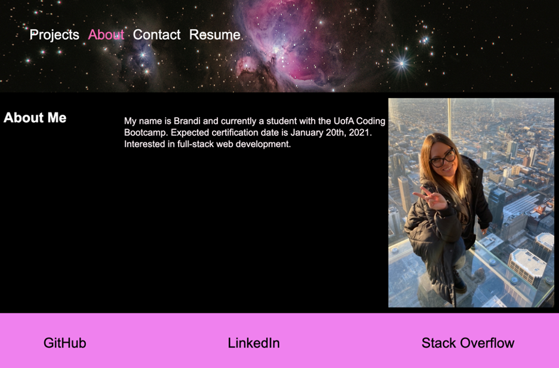

# Portfolio ReactSPA

## Description

This app was created with React.js and is a portfolio of past projects of mine that display various development skills. There are tabs that show projects, a contact form, about me, and a resume link. This is is a Single Page Application (SPA).

## Table of Contents 
* [Installation](#installation)
* [Usage](#usage)
* [Credits](#credits)
* [License](#license)

## Installation 
GitClone the repo and in the command line type "npm i" to download the packages and dependencies if you want to test the app in your local server. Otherwise, you can access the live web page.

## Usage 
To view and interact with the deployed app via GitHub pages, click the following link:

## https://galacticnative.github.io/portfolio-reactspa 

    
## Credits 
UofA Coding Bootcamp

## License 
React.js, Node.js

